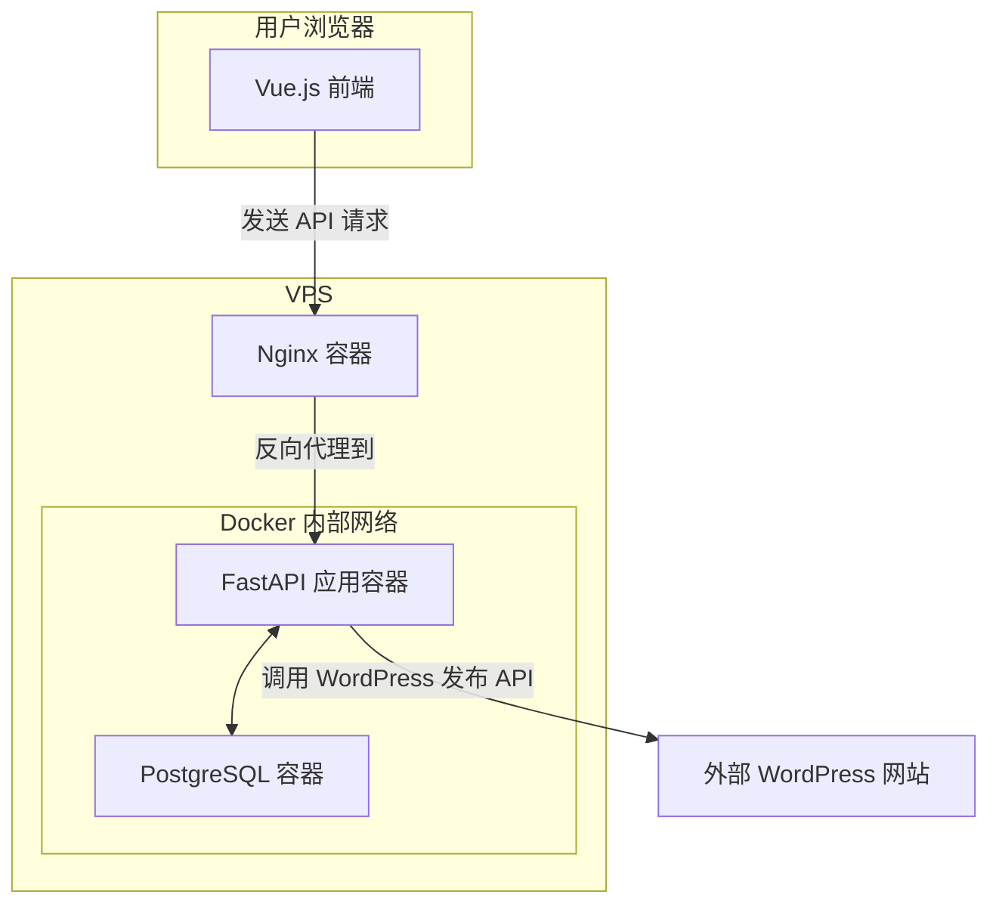

# 设计文档 v2.0：内容控制平台 (MCP)

## 1. 概述

本设计文档旨在为“内容控制平台”(MCP) 提供一个全面的技术蓝图。该系统基于已批准的需求文档 v1.1，采用 FastAPI 作为后端框架，Vue.js 作为前端框架，PostgreSQL 作为数据库，并以 Docker Compose 的方式进行容器化部署。

本文档将详细描述系统架构、核心组件、数据模型、API 接口、错误处理机制以及测试策略。

## 2. 系统架构

系统采用经典的三层架构，并由 Nginx 作为反向代理提供统一入口。


```mermaid
graph TD
    subgraph "用户浏览器"
        F[Vue.js 前端]
    end

    subgraph "VPS"
        B[Nginx 容器]

        subgraph "Docker 内部网络"
            C[FastAPI 应用容器]
            D[PostgreSQL 容器]
        end

        B -- "反向代理到" --> C;
        C <--> D;
    end

    E[外部 WordPress 网站]

    F -- "发送 API 请求" --> B;
    C -- "调用 WordPress 发布 API" --> E;
```
- **Nginx**: 作为系统的唯一入口，处理所有传入的HTTP请求，并将其反向代理到 FastAPI 应用。
    
- **FastAPI 应用 (MCP 后端)**: 系统的核心，负责处理所有业务逻辑。在开发模式下，通过卷挂载实现代码热重载。
    
- **PostgreSQL 数据库**: 通过 Docker 的命名卷 (Named Volume) 进行持久化存储，确保数据在容器重启后不丢失。
    
- **Vue.js 应用 (审核仪表盘)**: 运行在用户浏览器中的单页应用 (SPA)，通过调用后端 API 与系统交互。
    
## 3. 组件与接口

### 3.1 后端组件 (FastAPI)

#### 3.1.1 核心目录结构

codeCode

```
mcp/
├── .env.example        # 环境变量模板文件
├── main.py             # FastAPI 应用入口
├── api/                # API 路由定义
│   ├── v1/
│   │   ├── articles.py # 文章相关路由
│   │   └── auth.py     # 认证相关路由
├── core/               # 核心配置与服务
│   ├── config.py       # 配置管理 (环境变量)
│   ├── security.py     # JWT 和密码哈希逻辑
│   └── wordpress_client.py # 封装与WordPress交互的客户端
├── models/             # 数据模型
│   ├── user.py
│   └── article.py
└── db/                 # 数据库会话管理
    └── session.py
```

#### 3.1.2 配置管理

项目根目录下必须包含一个 .env.example 文件作为配置模板，.env 文件本身必须被添加到 .gitignore 中。所需环境变量包括：

- DATABASE_URL
    
- SECRET_KEY
    
- ALGORITHM
    
- ACCESS_TOKEN_EXPIRE_MINUTES
    
- AGENT_API_KEY
    
- WORDPRESS_API_URL
    
- WORDPRESS_USERNAME
    
- WORDPRESS_APP_PASSWORD
    
- FRONTEND_CORS_ORIGINS
    

#### 3.1.3 核心服务 WordPressClient

位于 core/wordpress_client.py，它将封装与 WordPress REST API 的所有交互，提供以下方法：

- __init__(api_url, username, app_password): 初始化客户端。
    
- get_tag_id(name): 根据标签名获取标签ID。
    
- get_category_id(name): 根据分类名获取分类ID。
    
- create_post(title, content, author_id, tags_ids, categories_ids): 创建新文章。
    

#### 3.1.4 API 端点设计

**认证接口 (/api/v1/auth)**

- POST /token: 接收表单数据 username 和 password，返回包含 access_token 和 refresh_token 的 JSON 对象。
    
- POST /refresh: 接收包含 refresh_token 的请求，返回新的 access_token。
    

**文章接口 (/api/v1/articles)**

- POST /submit: (供 Agent 使用) 接收文章草稿 JSON，需 X-API-Key 头进行认证。
    
- GET /: (供前端使用) 获取文章列表，支持按标题搜索和按创建时间排序，需 JWT 认证。
    
- GET /{article_id}: 获取单篇文章详情，需 JWT 认证。
    
- PUT /{article_id}: 更新文章内容，需 JWT 认证。
    
- POST /{article_id}/approve: 批准并触发发布流程，需 JWT 认证。
    
- POST /{article_id}/retry: 重试发布失败的文章，需 JWT 认证。
    
- DELETE /{article_id}: 拒绝并删除文章，需 JWT 认证。
    

### 3.2 前端组件 (Vue.js)

- **视图 (Views)**: Login.vue, Dashboard.vue, ArticleDetail.vue。
    
- **服务 (Services)**:
    
    - apiClient.js: 使用 Axios 封装所有 API 调用。必须实现请求拦截器来附加 JWT，以及响应拦截器来处理 Token 刷新。同时，应在此处管理一个全局加载状态（如通过 Pinia store），以便在 UI 中显示加载指示器。
        
    - authService.js: 处理登录、登出、Token 在 localStorage 中的存取。
        
- **用户体验 (UX)**:
    
    - **全局加载指示**: 应有一个全局组件（如顶部进度条），根据 apiClient.js 中管理的全局状态来显示或隐藏。
        
    - **按钮状态**: 所有触发 API 调用的按钮，在点击后必须立即进入“禁用”状态并显示加载指示 (spinner)，直到 API 调用完成（无论成功或失败）。
        

## 4. 数据模型 (PostgreSQL)

我们将使用 SQLModel 来定义数据模型，它同时服务于 Pydantic 和 SQLAlchemy。

- **User 模型**
    
    - id (PK, int)
        
    - username (string, unique, indexed)
        
    - hashed_password (string)
        
    - is_active (bool)
        
- **Article 模型**
    
    - id (PK, int)
        
    - title (string)
        
    - content_markdown (text)
        
    - content_html (text)
        
    - status (string, indexed) - 枚举值: pending_review, publishing, published, publish_failed, rejected
        
    - tags (JSON)
        
    - category (string)
        
    - created_at (datetime)
        
    - updated_at (datetime)
        
    - wordpress_post_id (int, nullable)
        
    - wordpress_permalink (string, nullable)
        
    - publish_error_message (string, nullable)
        

## 5. 错误处理

- **API 错误**: FastAPI 将通过自动生成的 422 Unprocessable Entity 响应处理数据验证错误。自定义的业务逻辑错误（如文章不存在）将通过 HTTPException 返回合适的 4xx 状态码。服务器内部错误将返回 500 Internal Server Error。
    
- **WordPress 发布失败**: WordPressClient 在调用失败时会抛出自定义异常。API 层捕获此异常，将文章状态更新为 publish_failed，并将具体的错误信息存入 publish_error_message 字段供用户查看。
    

## 6. 测试策略

- **后端 (Pytest)**:
    
    - **单元测试**: 对 core/security.py 和 core/wordpress_client.py 中的纯逻辑进行测试。
        
    - **集成测试**: 使用测试数据库，对每个 API 端点进行完整的请求-响应测试，覆盖所有业务逻辑和权限验证。
        
- **前端 (Vitest/Jest)**:
    
    - **组件测试**: 对关键 UI 组件（如登录表单）进行单元测试。
        
    - **端到端测试 (E2E)**: (可选，未来增强) 使用 Cypress 或 Playwright 模拟用户完整操作流程，如登录->批准文章->验证结果。
